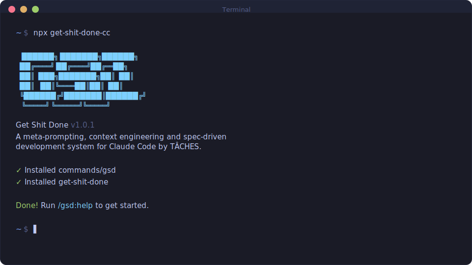

<div align="center">

# GET SHIT DONE

**한국어(기본)** · [English Reference (upstream v1.28.0)](https://github.com/gsd-build/get-shit-done/tree/v1.28.0)

> 유지보수 참고: 이 포크는 upstream `v1.28.0`을 기준으로 시작했습니다. 동기화 기준과 번역 가드레일은 [docs/UPSTREAM-SYNC.md](docs/UPSTREAM-SYNC.md), release 점검 절차는 [docs/RELEASE-CHECKLIST.md](docs/RELEASE-CHECKLIST.md)에서 확인할 수 있습니다.

**Claude Code, OpenCode, Gemini CLI, Codex, Copilot, Antigravity를 위한 가볍고 강력한 메타 프롬프팅, 컨텍스트 엔지니어링, 스펙 기반 개발 시스템입니다.**

**Claude의 컨텍스트 창이 차오르면서 품질이 떨어지는 문제, 즉 context rot를 완화합니다.**

[**문서 인덱스**](docs/README.md) | [**English Reference**](https://github.com/gsd-build/get-shit-done/tree/v1.28.0/docs)

[](https://www.npmjs.com/package/get-shit-done-cc)
[](https://www.npmjs.com/package/get-shit-done-cc)
[](https://github.com/glittercowboy/get-shit-done/actions/workflows/test.yml)
[](https://discord.gg/gsd)
[](https://x.com/gsd_foundation)
[](https://dexscreener.com/solana/dwudwjvan7bzkw9zwlbyv6kspdlvhwzrqy6ebk8xzxkv)
[](https://github.com/glittercowboy/get-shit-done)
[](LICENSE)

<br>

```bash
npx get-shit-done-cc@latest
```

**Mac, Windows, Linux에서 동작합니다.**

<br>



<br>

*"If you know clearly what you want, this WILL build it for you. No bs."*

*"I've done SpecKit, OpenSpec and Taskmaster — this has produced the best results for me."*

*"By far the most powerful addition to my Claude Code. Nothing over-engineered. Literally just gets shit done."*

<br>

**Amazon, Google, Shopify, Webflow의 엔지니어들도 사용하는 워크플로입니다.**

[왜 만들었는가](#why-i-built-this) · [작동 방식](#how-it-works) · [명령어](#commands) · [왜 잘 동작하는가](#why-it-works) · [사용자 가이드](docs/USER-GUIDE.md)

</div>

---

## Why I Built This

저는 1인 개발자입니다. 코드는 제가 직접 쓰기보다 Claude Code가 더 많이 씁니다.

BMAD나 Speckit 같은 스펙 기반 개발 도구도 이미 있습니다. 다만 많은 도구가 스프린트 세리머니, 스토리 포인트, 이해관계자 싱크, 회고, Jira 워크플로 같은 절차를 과하게 요구하거나, 내가 만들고 싶은 것의 큰 그림을 제대로 이해하지 못했습니다. 저는 50명 규모의 소프트웨어 회사를 운영하는 게 아닙니다. 기업 놀이를 하고 싶은 것도 아닙니다. 그냥 잘 작동하는 좋은 것을 만들고 싶은 창작자입니다.

그래서 GSD를 만들었습니다. 복잡함은 사용자의 워크플로가 아니라 시스템 내부에 숨겨 두었습니다. 뒤에서는 context engineering, XML 프롬프트 포맷팅, 서브에이전트 오케스트레이션, 상태 관리가 돌아가고, 사용자는 몇 개의 잘 동작하는 명령어만 보게 됩니다.

이 시스템은 Claude가 작업을 수행하고 검증하는 데 필요한 정보를 함께 제공합니다. 저는 이 워크플로를 신뢰합니다. 실제로 결과가 좋기 때문입니다.

이 프로젝트는 그런 도구입니다. 과한 엔터프라이즈 롤플레잉 없이, Claude Code로 멋진 결과물을 꾸준히 만들 수 있게 해 주는 실전형 시스템입니다.

— **TÂCHES**

---

vibecoding은 평판이 좋지 않습니다. 원하는 것을 설명하면 AI가 코드를 만들지만, 결과는 들쭉날쭉하고 규모가 커질수록 쉽게 무너집니다.

GSD는 그 문제를 해결하려고 만든 컨텍스트 엔지니어링 레이어입니다. 아이디어를 설명하면 시스템이 필요한 정보를 구조화해서 뽑아내고, Claude Code가 그 맥락 위에서 안정적으로 일할 수 있게 만듭니다.

---

## Who This Is For

50인 규모의 엔지니어링 조직처럼 행동하지 않아도, 원하는 것을 설명하고 그것이 제대로 구현되길 바라는 사람들을 위한 도구입니다.

---

## Getting Started

```bash
npx get-shit-done-cc@latest
```

설치기는 다음 두 가지를 묻습니다.
1. **Runtime** — Claude Code, OpenCode, Gemini, Codex, Copilot, Cursor, Antigravity, 혹은 전체
2. **Location** — Global(모든 프로젝트) 또는 local(현재 프로젝트만)

설치 확인:
- Claude Code / Gemini: `/gsd:help`
- OpenCode: `/gsd-help`
- Codex: `$gsd-help`
- Copilot: `/gsd:help`
- Antigravity: `/gsd:help`

> [!NOTE]
> Codex 설치는 커스텀 프롬프트 대신 skills(`skills/gsd-*/SKILL.md`)를 사용합니다.

### Staying Updated

GSD는 빠르게 바뀝니다. 주기적으로 업데이트하는 편이 좋습니다.

```bash
npx get-shit-done-cc@latest
```

<details>
<summary><strong>Non-interactive Install (Docker, CI, Scripts)</strong></summary>

```bash
# Claude Code
npx get-shit-done-cc --claude --global   # Install to ~/.claude/
npx get-shit-done-cc --claude --local    # Install to ./.claude/

# OpenCode (open source, free models)
npx get-shit-done-cc --opencode --global # Install to ~/.config/opencode/

# Gemini CLI
npx get-shit-done-cc --gemini --global   # Install to ~/.gemini/

# Codex (skills-first)
npx get-shit-done-cc --codex --global    # Install to ~/.codex/
npx get-shit-done-cc --codex --local     # Install to ./.codex/

# Copilot (GitHub Copilot CLI)
npx get-shit-done-cc --copilot --global  # Install to ~/.github/
npx get-shit-done-cc --copilot --local   # Install to ./.github/

# Cursor CLI
npx get-shit-done-cc --cursor --global      # Install to ~/.cursor/
npx get-shit-done-cc --cursor --local       # Install to ./.cursor/

# Antigravity (Google, skills-first, Gemini-based)
npx get-shit-done-cc --antigravity --global # Install to ~/.gemini/antigravity/
npx get-shit-done-cc --antigravity --local  # Install to ./.agent/

# All runtimes
npx get-shit-done-cc --all --global      # Install to all directories
```

`--global`(`-g`) 또는 `--local`(`-l`)을 사용하면 위치 선택 프롬프트를 건너뜁니다.
`--claude`, `--opencode`, `--gemini`, `--codex`, `--copilot`, `--cursor`, `--antigravity`, `--all`을 사용하면 런타임 선택 프롬프트를 건너뜁니다.

</details>

<details>
<summary><strong>Development Installation</strong></summary>

저장소를 클론한 뒤 설치기를 로컬에서 실행할 수도 있습니다.

```bash
git clone https://github.com/glittercowboy/get-shit-done.git
cd get-shit-done
node bin/install.js --claude --local
```

기여 전에 수정 사항을 시험할 수 있도록 `./.claude/`에 설치합니다.

</details>

### Recommended: Skip Permissions Mode

GSD는 승인 마찰이 적은 자동화를 기준으로 설계되었습니다. Claude Code는 다음처럼 실행하는 편이 가장 자연스럽습니다.

```bash
claude --dangerously-skip-permissions
```

> [!TIP]
> `date`나 `git commit` 같은 명령을 수십 번 승인해야 한다면 GSD를 쓰는 장점이 크게 줄어듭니다.

<details>
<summary><strong>Alternative: Granular Permissions</strong></summary>

이 플래그를 쓰고 싶지 않다면 프로젝트의 `.claude/settings.json`에 다음과 같이 허용 목록을 넣을 수 있습니다.

```json
{
  "permissions": {
    "allow": [
      "Bash(date:*)",
      "Bash(echo:*)",
      "Bash(cat:*)",
      "Bash(ls:*)",
      "Bash(mkdir:*)",
      "Bash(wc:*)",
      "Bash(head:*)",
      "Bash(tail:*)",
      "Bash(sort:*)",
      "Bash(grep:*)",
      "Bash(tr:*)",
      "Bash(git add:*)",
      "Bash(git commit:*)",
      "Bash(git status:*)",
      "Bash(git log:*)",
      "Bash(git diff:*)",
      "Bash(git tag:*)"
    ]
  }
}
```

</details>

---

## How It Works

> **이미 코드가 있나요?** 먼저 `/gsd:map-codebase`를 실행하세요. 병렬 에이전트가 스택, 아키텍처, 관례, 리스크를 분석하고, 이후 `/gsd:new-project`가 기존 코드베이스를 이해한 상태에서 질문과 계획을 이어 갑니다.

### 1. Initialize Project

```
/gsd:new-project
```

명령 하나로 전체 초기화 흐름이 시작됩니다. 시스템은 다음을 수행합니다.

1. **Questions** — 아이디어를 충분히 이해할 때까지 목표, 제약, 기술 선호, 예외 상황을 질문합니다.
2. **Research** — 도메인을 조사하는 병렬 에이전트를 실행합니다. 선택 사항이지만 권장됩니다.
3. **Requirements** — v1, v2, 범위 외 항목을 정리합니다.
4. **Roadmap** — 요구사항과 연결된 phase 계획을 만듭니다.

로드맵을 승인하면 바로 구현 단계로 들어갈 수 있습니다.

**Creates:** `PROJECT.md`, `REQUIREMENTS.md`, `ROADMAP.md`, `STATE.md`, `.planning/research/`

---

### 2. Discuss Phase

```
/gsd:discuss-phase 1
```

**여기서 실제 구현 방향을 다듬습니다.**

로드맵의 각 phase에는 보통 한두 문장만 들어 있습니다. 그것만으로는 *당신이 머릿속에서 그린 방식*대로 만들기에 맥락이 부족합니다. 이 단계는 연구나 계획에 들어가기 전에 사용자의 선호와 의도를 고정하는 역할을 합니다.

시스템은 phase를 분석한 뒤, 구현 대상에 따라 불확실한 결정 지점을 찾아냅니다.

- **Visual features** → 레이아웃, 밀도, 상호작용, 빈 상태
- **APIs/CLIs** → 응답 형식, flags, 오류 처리, verbosity
- **Content systems** → 구조, 톤, 깊이, 흐름
- **Organization tasks** → 분류 기준, 네이밍, 중복 처리, 예외

선택한 영역마다 만족할 때까지 질문이 이어지고, 그 결과물인 `CONTEXT.md`가 다음 두 단계의 입력으로 직접 사용됩니다.

1. **Researcher reads it** — 어떤 패턴을 조사해야 하는지 이해합니다.
2. **Planner reads it** — 어떤 의사결정이 이미 고정되었는지 이해합니다.

이 단계에서 구체적으로 답할수록 시스템은 더 정확히 당신이 원하는 구현을 향해 갑니다. 건너뛰면 무난한 기본값을 쓰고, 적극적으로 활용하면 *당신의 비전*에 가까워집니다.

**Creates:** `{phase_num}-CONTEXT.md`

---

### 3. Plan Phase

```
/gsd:plan-phase 1
```

시스템은 다음을 수행합니다.

1. **Researches** — `CONTEXT.md`의 결정을 바탕으로 이 phase를 어떻게 구현할지 조사합니다.
2. **Plans** — XML 구조를 갖춘 2~3개의 원자적 task plan을 만듭니다.
3. **Verifies** — 계획이 요구사항을 만족하는지 확인하고, 통과할 때까지 반복합니다.

각 plan은 새로운 context window에서 무리 없이 실행될 정도로 작게 유지됩니다. 그래서 문맥 열화나 "이제 더 간단히 답할게요" 같은 품질 저하를 줄일 수 있습니다.

**Creates:** `{phase_num}-RESEARCH.md`, `{phase_num}-{N}-PLAN.md`

---

### 4. Execute Phase

```
/gsd:execute-phase 1
```

시스템은 다음을 수행합니다.

1. **Runs plans in waves** — 병렬 가능한 것은 함께, 의존성이 있으면 순차적으로 실행합니다.
2. **Fresh context per plan** — 각 plan은 구현만을 위한 새 컨텍스트에서 실행됩니다.
3. **Commits per task** — 모든 task는 원자적인 개별 commit을 가집니다.
4. **Verifies against goals** — 결과물이 phase 목표를 실제로 충족하는지 확인합니다.

자리를 비웠다가 돌아와도, 정리된 git 히스토리와 함께 완료된 결과를 확인할 수 있습니다.

**Wave 실행 방식**

plan은 의존 관계에 따라 "wave"로 묶입니다. 같은 wave 안에서는 병렬 실행하고, wave끼리는 순차 실행합니다.

```
┌────────────────────────────────────────────────────────────────────┐
│  PHASE EXECUTION                                                   │
├────────────────────────────────────────────────────────────────────┤
│                                                                    │
│  WAVE 1 (parallel)          WAVE 2 (parallel)          WAVE 3      │
│  ┌─────────┐ ┌─────────┐    ┌─────────┐ ┌─────────┐    ┌─────────┐ │
│  │ Plan 01 │ │ Plan 02 │ →  │ Plan 03 │ │ Plan 04 │ →  │ Plan 05 │ │
│  │         │ │         │    │         │ │         │    │         │ │
│  │ User    │ │ Product │    │ Orders  │ │ Cart    │    │ Checkout│ │
│  │ Model   │ │ Model   │    │ API     │ │ API     │    │ UI      │ │
│  └─────────┘ └─────────┘    └─────────┘ └─────────┘    └─────────┘ │
│       │           │              ↑           ↑              ↑      │
│       └───────────┴──────────────┴───────────┘              │      │
│              Dependencies: Plan 03 needs Plan 01            │      │
│                          Plan 04 needs Plan 02              │      │
│                          Plan 05 needs Plans 03 + 04        │      │
│                                                                    │
└────────────────────────────────────────────────────────────────────┘
```

**wave가 중요한 이유**
- 독립적인 plan → 같은 wave → 병렬 실행
- 의존성이 있는 plan → 더 뒤의 wave → 선행 작업을 기다림
- 파일 충돌 가능성 → 순차 실행 또는 하나의 plan으로 묶음

"vertical slice"(예: 사용자 기능을 end-to-end로 한 묶음) 방식이 "horizontal layer"(예: 모델 전체, API 전체) 방식보다 병렬화에 유리한 이유도 여기에 있습니다.

**Creates:** `{phase_num}-{N}-SUMMARY.md`, `{phase_num}-VERIFICATION.md`

---

### 5. Verify Work

```
/gsd:verify-work 1
```

**여기서 결과물이 정말 기대대로 동작하는지 확인합니다.**

자동 검증은 코드 존재 여부와 테스트 통과 여부를 확인해 줍니다. 하지만 기능이 *원하는 방식대로* 동작하는지는 직접 확인해야 합니다. 이 단계가 그 자리입니다.

시스템은 다음을 수행합니다.

1. **Extracts testable deliverables** — 지금 시점에서 실제로 해 볼 수 있어야 하는 항목을 뽑아냅니다.
2. **Walks you through one at a time** — 항목별로 예/아니오 또는 문제 설명을 받습니다.
3. **Diagnoses failures automatically** — 실패 원인을 찾기 위해 debug agent를 실행합니다.
4. **Creates verified fix plans** — 바로 다시 실행 가능한 수정 plan을 만듭니다.

모든 것이 통과하면 다음 단계로 넘어가고, 문제가 있으면 직접 수동 디버깅하기보다 생성된 수정 plan으로 `/gsd:execute-phase`를 다시 돌리면 됩니다.

**Creates:** `{phase_num}-UAT.md`, fix plans if issues found

---

### 6. Repeat → Ship → Complete → Next Milestone

```
/gsd:discuss-phase 2
/gsd:plan-phase 2
/gsd:execute-phase 2
/gsd:verify-work 2
/gsd:ship 2                  # Create PR from verified work
...
/gsd:complete-milestone
/gsd:new-milestone
```

다음 단계를 자동으로 맡기고 싶다면:

```
/gsd:next                    # Auto-detect and run next step
```

milestone이 끝날 때까지 **discuss → plan → execute → verify → ship**을 반복합니다.

discussion 단계에서 더 빠르게 진행하고 싶다면 `/gsd:discuss-phase <n> --batch`로 질문을 묶어서 받을 수 있습니다.

각 phase는 사용자 입력(discuss), 충분한 조사(plan), 깔끔한 실행(execute), 사람 검증(verify)을 거칩니다. 컨텍스트는 신선하게 유지되고 품질도 안정적입니다.

모든 phase가 끝나면 `/gsd:complete-milestone`이 milestone을 아카이브하고 릴리스 태그를 남깁니다.

그 다음 `/gsd:new-milestone`으로 다음 버전을 시작합니다. `new-project`와 비슷한 흐름이지만 기존 코드베이스를 전제로 하며, 다음에 만들 것을 설명하면 도메인 조사, 요구사항 범위화, 새 roadmap 생성으로 이어집니다.

---

### Quick Mode

```
/gsd:quick
```

**전체 planning이 필요 없는 작은 작업용 모드입니다.**

Quick mode는 더 짧은 경로로 GSD의 핵심 보장(atomic commit, state tracking)을 제공합니다.

- **Same agents** — planner와 executor를 그대로 사용합니다.
- **Skips optional steps** — 기본값으로 research, plan checker, verifier를 생략합니다.
- **Separate tracking** — phase가 아닌 `.planning/quick/` 아래에서 별도로 추적합니다.

**`--discuss` flag:** planning 전에 불확실한 지점을 가볍게 정리합니다.

**`--research` flag:** planning 전에 집중형 researcher를 실행해 구현 접근법, 라이브러리 선택지, 함정을 조사합니다.

**`--full` flag:** 최대 2회 plan-checking과 실행 후 verification을 켭니다.

flag는 조합할 수 있습니다. `--discuss --research --full`이면 discussion, research, plan-checking, verification이 모두 적용됩니다.

```
/gsd:quick
> What do you want to do? "Add dark mode toggle to settings"
```

**Creates:** `.planning/quick/001-add-dark-mode-toggle/PLAN.md`, `SUMMARY.md`

---

## Why It Works

### Context Engineering

Claude Code는 필요한 컨텍스트를 충분히 받으면 매우 강력합니다. 문제는 대부분 그 컨텍스트를 제대로 주지 못한다는 점입니다.

GSD는 그 부분을 대신 구조화합니다.

| 파일 | 역할 |
|------|--------------|
| `PROJECT.md` | 프로젝트 비전, 항상 로드됨 |
| `research/` | 스택, 기능, 아키텍처, 함정에 대한 조사 결과 |
| `REQUIREMENTS.md` | v1/v2 요구사항과 phase 추적성 |
| `ROADMAP.md` | 어디까지 왔고 어디로 가는지 |
| `STATE.md` | 의사결정, blockers, 현재 위치를 담는 세션 메모리 |
| `PLAN.md` | XML 구조를 가진 원자적 작업 계획 |
| `SUMMARY.md` | 무엇을 했고 무엇이 바뀌었는지에 대한 결과 기록 |
| `todos/` | 나중을 위한 아이디어와 작업 |
| `threads/` | 세션을 가로지르는 지속형 컨텍스트 |
| `seeds/` | 적절한 milestone에서 떠오르도록 심어 둔 아이디어 |

이 구조는 Claude 품질이 흔들리기 시작하는 지점을 기준으로 설계되어 있습니다. 한계를 넘지 않으면 결과 품질도 훨씬 안정적입니다.

### XML Prompt Formatting

모든 plan은 Claude가 읽기 좋도록 XML 구조로 정리됩니다.

```xml
<task type="auto">
  <name>Create login endpoint</name>
  <files>src/app/api/auth/login/route.ts</files>
  <action>
    Use jose for JWT (not jsonwebtoken - CommonJS issues).
    Validate credentials against users table.
    Return httpOnly cookie on success.
  </action>
  <verify>curl -X POST localhost:3000/api/auth/login returns 200 + Set-Cookie</verify>
  <done>Valid credentials return cookie, invalid return 401</done>
</task>
```

지시가 명확하고, 추측할 여지를 줄이며, 검증 단계가 기본 포함됩니다.

### Multi-Agent Orchestration

각 단계는 같은 패턴을 따릅니다. 얇은 orchestrator가 전문 에이전트를 실행하고, 결과를 모으고, 다음 단계로 연결합니다.

| 단계 | Orchestrator 역할 | Agent 역할 |
|-------|------------------|-----------|
| Research | 조율하고 결과를 제시함 | 4개의 researcher가 stack, features, architecture, pitfalls를 조사 |
| Planning | 검증하고 반복을 관리함 | planner가 plan 작성, checker가 검증, 통과까지 반복 |
| Execution | wave를 묶고 진행 상황을 추적함 | executor가 병렬 구현, 각자 새 200k 컨텍스트 사용 |
| Verification | 결과를 제시하고 다음 단계로 라우팅함 | verifier가 목표 충족 여부를 확인, debugger가 실패 원인 분석 |

orchestrator는 무거운 작업을 직접 하지 않습니다. 에이전트를 실행하고, 기다리고, 결과를 통합합니다.

**결과적으로** 깊은 연구, 여러 plan 생성과 검증, 병렬 executor의 대량 코드 작성, 목표 기준 자동 검증까지 한 phase 전체를 돌려도 메인 컨텍스트는 비교적 가볍게 유지됩니다. 실제 작업은 신선한 서브에이전트 컨텍스트에서 수행됩니다.

### Atomic Git Commits

각 task는 완료 직후 자기만의 commit을 가집니다.

```bash
abc123f docs(08-02): complete user registration plan
def456g feat(08-02): add email confirmation flow
hij789k feat(08-02): implement password hashing
lmn012o feat(08-02): create registration endpoint
```

> [!NOTE]
> **장점:** Git bisect로 문제 task를 정확히 찾기 쉽고, 각 task를 독립적으로 되돌릴 수 있으며, 이후 세션에서도 Claude가 더 명확한 히스토리를 참고할 수 있습니다.

각 commit은 작고 추적 가능하며 의미 단위가 분명합니다.

### Modular by Design

- 현재 milestone에 phase 추가
- phase 사이에 긴급 작업 삽입
- milestone 완료 후 새 사이클 시작
- 전체를 갈아엎지 않고 plan 조정

즉, 흐름에 갇히지 않고 상황에 맞게 조정할 수 있습니다.

---

## Commands

### Core Workflow

| Command | What it does |
|---------|--------------|
| `/gsd:new-project [--auto]` | Full initialization: questions → research → requirements → roadmap |
| `/gsd:discuss-phase [N] [--auto] [--analyze]` | Capture implementation decisions before planning (`--analyze` adds trade-off analysis) |
| `/gsd:plan-phase [N] [--auto]` | Research + plan + verify for a phase |
| `/gsd:execute-phase <N>` | Execute all plans in parallel waves, verify when complete |
| `/gsd:verify-work [N]` | Manual user acceptance testing ¹ |
| `/gsd:ship [N] [--draft]` | Create PR from verified phase work with auto-generated body |
| `/gsd:next` | Automatically advance to the next logical workflow step |
| `/gsd:fast <text>` | Inline trivial tasks — skips planning entirely, executes immediately |
| `/gsd:audit-milestone` | Verify milestone achieved its definition of done |
| `/gsd:complete-milestone` | Archive milestone, tag release |
| `/gsd:new-milestone [name]` | Start next version: questions → research → requirements → roadmap |

### UI Design

| Command | What it does |
|---------|--------------|
| `/gsd:ui-phase [N]` | Generate UI design contract (UI-SPEC.md) for frontend phases |
| `/gsd:ui-review [N]` | Retroactive 6-pillar visual audit of implemented frontend code |

### Navigation

| Command | What it does |
|---------|--------------|
| `/gsd:progress` | Where am I? What's next? |
| `/gsd:next` | Auto-detect state and run the next step |
| `/gsd:help` | Show all commands and usage guide |
| `/gsd:update` | Update GSD with changelog preview |
| `/gsd:join-discord` | Join the GSD Discord community |

### Brownfield

| Command | What it does |
|---------|--------------|
| `/gsd:map-codebase [area]` | Analyze existing codebase before new-project |

### Phase Management

| Command | What it does |
|---------|--------------|
| `/gsd:add-phase` | Append phase to roadmap |
| `/gsd:insert-phase [N]` | Insert urgent work between phases |
| `/gsd:remove-phase [N]` | Remove future phase, renumber |
| `/gsd:list-phase-assumptions [N]` | See Claude's intended approach before planning |
| `/gsd:plan-milestone-gaps` | Create phases to close gaps from audit |

### Session

| Command | What it does |
|---------|--------------|
| `/gsd:pause-work` | Create handoff when stopping mid-phase (writes HANDOFF.json) |
| `/gsd:resume-work` | Restore from last session |
| `/gsd:session-report` | Generate session summary with work performed and outcomes |

### Code Quality

| Command | What it does |
|---------|--------------|
| `/gsd:review` | Cross-AI peer review of current phase or branch |
| `/gsd:pr-branch` | Create clean PR branch filtering `.planning/` commits |
| `/gsd:audit-uat` | Audit verification debt — find phases missing UAT |

### Backlog & Threads

| Command | What it does |
|---------|--------------|
| `/gsd:plant-seed <idea>` | Capture forward-looking ideas with trigger conditions — surfaces at the right milestone |
| `/gsd:add-backlog <desc>` | Add idea to backlog parking lot (999.x numbering, outside active sequence) |
| `/gsd:review-backlog` | Review and promote backlog items to active milestone or remove stale entries |
| `/gsd:thread [name]` | Persistent context threads — lightweight cross-session knowledge for work spanning multiple sessions |

### Utilities

| Command | What it does |
|---------|--------------|
| `/gsd:settings` | Configure model profile and workflow agents |
| `/gsd:set-profile <profile>` | Switch model profile (quality/balanced/budget/inherit) |
| `/gsd:add-todo [desc]` | Capture idea for later |
| `/gsd:check-todos` | List pending todos |
| `/gsd:debug [desc]` | Systematic debugging with persistent state |
| `/gsd:do <text>` | Route freeform text to the right GSD command automatically |
| `/gsd:note <text>` | Zero-friction idea capture — append, list, or promote notes to todos |
| `/gsd:quick [--full] [--discuss] [--research]` | Execute ad-hoc task with GSD guarantees (`--full` adds plan-checking and verification, `--discuss` gathers context first, `--research` investigates approaches before planning) |
| `/gsd:health [--repair]` | Validate `.planning/` directory integrity, auto-repair with `--repair` |
| `/gsd:stats` | Display project statistics — phases, plans, requirements, git metrics |
| `/gsd:profile-user [--questionnaire] [--refresh]` | Generate developer behavioral profile from session analysis for personalized responses |

<sup>¹ Contributed by reddit user OracleGreyBeard</sup>

---

## Configuration

GSD stores project settings in `.planning/config.json`. Configure during `/gsd:new-project` or update later with `/gsd:settings`. For the full config schema, workflow toggles, git branching options, and per-agent model breakdown, see the [User Guide](docs/USER-GUIDE.md#configuration-reference).

### Core Settings

| Setting | Options | Default | What it controls |
|---------|---------|---------|------------------|
| `mode` | `yolo`, `interactive` | `interactive` | Auto-approve vs confirm at each step |
| `granularity` | `coarse`, `standard`, `fine` | `standard` | Phase granularity — how finely scope is sliced (phases × plans) |

### Model Profiles

Control which Claude model each agent uses. Balance quality vs token spend.

| Profile | Planning | Execution | Verification |
|---------|----------|-----------|--------------|
| `quality` | Opus | Opus | Sonnet |
| `balanced` (default) | Opus | Sonnet | Sonnet |
| `budget` | Sonnet | Sonnet | Haiku |
| `inherit` | Inherit | Inherit | Inherit |

Switch profiles:
```
/gsd:set-profile budget
```

Use `inherit` when using non-Anthropic providers (OpenRouter, local models) or to follow the current runtime model selection (e.g. OpenCode `/model`).

Or configure via `/gsd:settings`.

### Workflow Agents

These spawn additional agents during planning/execution. They improve quality but add tokens and time.

| Setting | Default | What it does |
|---------|---------|--------------|
| `workflow.research` | `true` | Researches domain before planning each phase |
| `workflow.plan_check` | `true` | Verifies plans achieve phase goals before execution |
| `workflow.verifier` | `true` | Confirms must-haves were delivered after execution |
| `workflow.auto_advance` | `false` | Auto-chain discuss → plan → execute without stopping |
| `workflow.research_before_questions` | `false` | Run research before discussion questions instead of after |

Use `/gsd:settings` to toggle these, or override per-invocation:
- `/gsd:plan-phase --skip-research`
- `/gsd:plan-phase --skip-verify`

### Execution

| Setting | Default | What it controls |
|---------|---------|------------------|
| `parallelization.enabled` | `true` | Run independent plans simultaneously |
| `planning.commit_docs` | `true` | Track `.planning/` in git |
| `hooks.context_warnings` | `true` | Show context window usage warnings |

### Git Branching

Control how GSD handles branches during execution.

| Setting | Options | Default | What it does |
|---------|---------|---------|--------------|
| `git.branching_strategy` | `none`, `phase`, `milestone` | `none` | Branch creation strategy |
| `git.phase_branch_template` | string | `gsd/phase-{phase}-{slug}` | Template for phase branches |
| `git.milestone_branch_template` | string | `gsd/{milestone}-{slug}` | Template for milestone branches |

**Strategies:**
- **`none`** — Commits to current branch (default GSD behavior)
- **`phase`** — Creates a branch per phase, merges at phase completion
- **`milestone`** — Creates one branch for entire milestone, merges at completion

At milestone completion, GSD offers squash merge (recommended) or merge with history.

---

## Security

### Built-in Security Hardening

GSD includes defense-in-depth security since v1.27:

- **Path traversal prevention** — All user-supplied file paths (`--text-file`, `--prd`) are validated to resolve within the project directory
- **Prompt injection detection** — Centralized `security.cjs` module scans for injection patterns in user-supplied text before it enters planning artifacts
- **PreToolUse prompt guard hook** — `gsd-prompt-guard` scans writes to `.planning/` for embedded injection vectors (advisory, not blocking)
- **Safe JSON parsing** — Malformed `--fields` arguments are caught before they corrupt state
- **Shell argument validation** — User text is sanitized before shell interpolation
- **CI-ready injection scanner** — `prompt-injection-scan.test.cjs` scans all agent/workflow/command files for embedded injection vectors

> [!NOTE]
> Because GSD generates markdown files that become LLM system prompts, any user-controlled text flowing into planning artifacts is a potential indirect prompt injection vector. These protections are designed to catch such vectors at multiple layers.

### Protecting Sensitive Files

GSD's codebase mapping and analysis commands read files to understand your project. **Protect files containing secrets** by adding them to Claude Code's deny list:

1. Open Claude Code settings (`.claude/settings.json` or global)
2. Add sensitive file patterns to the deny list:

```json
{
  "permissions": {
    "deny": [
      "Read(.env)",
      "Read(.env.*)",
      "Read(**/secrets/*)",
      "Read(**/*credential*)",
      "Read(**/*.pem)",
      "Read(**/*.key)"
    ]
  }
}
```

This prevents Claude from reading these files entirely, regardless of what commands you run.

> [!IMPORTANT]
> GSD includes built-in protections against committing secrets, but defense-in-depth is best practice. Deny read access to sensitive files as a first line of defense.

---

## Troubleshooting

**Commands not found after install?**
- Restart your runtime to reload commands/skills
- Verify files exist in `~/.claude/commands/gsd/` (global) or `./.claude/commands/gsd/` (local)
- For Codex, verify skills exist in `~/.codex/skills/gsd-*/SKILL.md` (global) or `./.codex/skills/gsd-*/SKILL.md` (local)

**Commands not working as expected?**
- Run `/gsd:help` to verify installation
- Re-run `npx get-shit-done-cc` to reinstall

**Updating to the latest version?**
```bash
npx get-shit-done-cc@latest
```

**Using Docker or containerized environments?**

If file reads fail with tilde paths (`~/.claude/...`), set `CLAUDE_CONFIG_DIR` before installing:
```bash
CLAUDE_CONFIG_DIR=/home/youruser/.claude npx get-shit-done-cc --global
```
This ensures absolute paths are used instead of `~` which may not expand correctly in containers.

### Uninstalling

To remove GSD completely:

```bash
# Global installs
npx get-shit-done-cc --claude --global --uninstall
npx get-shit-done-cc --opencode --global --uninstall
npx get-shit-done-cc --gemini --global --uninstall
npx get-shit-done-cc --codex --global --uninstall
npx get-shit-done-cc --copilot --global --uninstall
npx get-shit-done-cc --cursor --global --uninstall
npx get-shit-done-cc --antigravity --global --uninstall

# Local installs (current project)
npx get-shit-done-cc --claude --local --uninstall
npx get-shit-done-cc --opencode --local --uninstall
npx get-shit-done-cc --codex --local --uninstall
npx get-shit-done-cc --copilot --local --uninstall
npx get-shit-done-cc --cursor --local --uninstall
npx get-shit-done-cc --antigravity --local --uninstall
```

This removes all GSD commands, agents, hooks, and settings while preserving your other configurations.

---

## Community Ports

OpenCode, Gemini CLI, and Codex are now natively supported via `npx get-shit-done-cc`.

These community ports pioneered multi-runtime support:

| Project | Platform | Description |
|---------|----------|-------------|
| [gsd-opencode](https://github.com/rokicool/gsd-opencode) | OpenCode | Original OpenCode adaptation |
| gsd-gemini (archived) | Gemini CLI | Original Gemini adaptation by uberfuzzy |

---

## Star History

<a href="https://star-history.com/#glittercowboy/get-shit-done&Date">
 <picture>
   <source media="(prefers-color-scheme: dark)" srcset="https://api.star-history.com/svg?repos=glittercowboy/get-shit-done&type=Date&theme=dark" />
   <source media="(prefers-color-scheme: light)" srcset="https://api.star-history.com/svg?repos=glittercowboy/get-shit-done&type=Date" />
   
 </picture>
</a>

---

## License

MIT License. See [LICENSE](LICENSE) for details.

---

<div align="center">

**Claude Code is powerful. GSD makes it reliable.**

</div>
